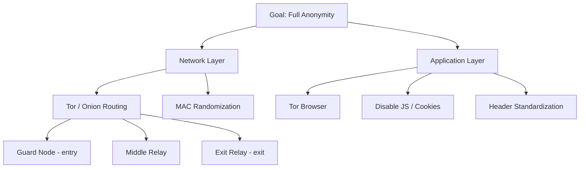

---

tags:

- security
- anonymity
- privacy
- tor
- onion-routing
- network-security

---

# Anonymity and Privacy

## Overview

**Anonymity** and **Privacy** are two important security properties that differ fundamentally in nature. In today's digital world, user data has become a commodity — "If you're not paying for it, you become the product." Every layer of the network stack can leak identifying information, and achieving true anonymity on the Internet is an extremely difficult problem. This lecture analyzes each leakage vector and defense mechanisms, with a particular focus on Tor — the most widely used anonymity network today.

---

## Detailed Content

### 1. Definitions: Anonymity vs Privacy

|Concept|Definition|Question Answered|
|---|---|---|
|**Anonymity**|Users can use resources/services without revealing their identity. Other parties cannot determine the user's identity.|_"Who are you?"_ — cannot be determined|
|**Privacy**|The right of an individual/organization to decide **when**, **how**, and **to what extent** their information is shared with others.|_"What are you doing?"_ — cannot be determined|

> [!note] A Clearer Distinction
> 
> - **Anonymity** = hiding **identity** (who is doing it)
> - **Privacy** = hiding **information/actions** (what is being done)
> - The two concepts complement each other but are independent: you can be anonymous but not private (using Tor to post publicly), or private but not anonymous (using your real name but encrypting the content).

**Two related properties:**

- **Unlinkability**: unable to link different actions of the same user
- **Unobservability**: unable to detect that communication is occurring

**Common adversary model:**

- MITM (eavesdropping or active)
- Contacted endpoint (e.g., the website operator knows you're visiting)

---

### 2. Information Leakage Points Across the Network Stack

Every layer of the OSI model can reveal user identity or behavior:

#### 2.1 Physical Layer

- Requires physical access to the network hardware/medium
- **Network tap**: a physical device for eavesdropping on traffic
- A sufficiently powerful adversary can determine physical location from RF signals

#### 2.2 Data Link Layer — MAC Address

- **MAC address** (Media Access Control) must be unique for routing within a LAN
- Manufacturers encode the first 3 bytes of the MAC → **OUI (Organizationally Unique Identifier)**
- MAC address reveals: manufacturer, sometimes device model, factory, series
- **Observation scope**: MAC is only visible within the same broadcast domain (does not cross routers)
- **Tracking applications**: WiFi probe requests, BLE advertising — devices constantly broadcast their MAC to find familiar networks → can track people moving through shopping malls

> [!tip] Preventing MAC Tracking **MAC address randomization**: Modern iOS, Android, and Linux automatically randomize MAC when scanning WiFi (not connected). When connected, some devices still use their real MAC → still trackable within a network.

#### 2.3 Network Layer — IP Address

- ==This is the primary target for identity exposure on the Internet==
- **AS (Autonomous System)**: IP address ranges are allocated to specific organizations → who owns which IP is public information (WHOIS, RIPE, ARIN...)
- **IP is often static**: many ISPs assign fixed or rarely changing IPs → bound to specific users
- **DNS**: mapping between IP and domain name → another identification vector
- **NAT (Network Address Translation)**: multiple users share one public IP → slightly reduces accuracy, but the anonymity set is still small
- **Traffic analysis**: traffic statistics (timing, volume, pattern) can identify users even when content is encrypted
- **Active fingerprinting**: different OSes set different initial TTL values (Linux = 64, Windows = 128, Cisco = 255) → OS can be guessed from packets

#### 2.4 Transport Layer — TCP

- **Port numbers**: reveal running applications (80=HTTP, 443=HTTPS, 22=SSH...)
- **Passive fingerprinting**: TCP sequence number, congestion window size, TCP options (SACK, timestamps, window scaling) → identify TCP stack implementation → identify OS/software
- **Active fingerprinting**: send TCP segments with unusual flags, observe the response

#### 2.5 Application Layer

- **Session identifiers**: session tokens, usernames, cookies
- **Location & language**: HTTP `Accept-Language`, timezone, IP geolocation
- **Software version**: `User-Agent` header reveals exact browser and version
- **Encoding preferences**: `Accept-Encoding`, `Accept` headers
- **Data content**: request/response content

> [!question] Discussion: Does incognito mode make you anonymous? Even in incognito mode, `sutd.edu.sg` still knows: your IP address, browser and OS (from User-Agent), screen size, timezone, language, installed fonts, plugins, and dozens of other attributes → **browser fingerprinting**. Incognito only prevents the browser from _saving_ history on your machine — it does not make you anonymous to the server.

---

### 3. Mechanisms for Improving Privacy and Anonymity

#### 3.1 Encryption — Necessary but Not Sufficient

Encryption hides the content of upper layers:

- **IPSec**: protects the transport layer (hides ports, TCP flags)
- **TLS**: protects the application layer (hides HTTP content)

**But even with encryption, a passive adversary can still learn:**

- **Timing**: when you communicate
- **Packet length**: data size → can infer content

> [!example] Attack via Timing/Length If you browse `https://wikipedia.org`, the English and Vietnamese pages have different sizes. An adversary observing encrypted traffic can guess which page you're reading based on packet size patterns — this is called a **website fingerprinting attack**.

**Encryption does not hide metadata**: who communicates with whom, frequency, timing — still visible.

---

### 4. Network-layer Anonymity

To truly be anonymous, protection **must** start from the Network layer upward. Protecting the Application layer without protecting the Network layer is meaningless because an IP address alone is sufficient to identify you with high accuracy.

**Requirements for an anonymous communication system:**

- **Low latency** (most important for regular users)
- Sufficient bandwidth
- Strong enough security

**Adversary model** from weak to strong:

- Your ISP
- State-level adversary (government observing part of the Internet)
- Global adversary (NSA-level, observing the entire Internet)
- Bob (destination) — knows who is connecting to them

---

### 5. Proxy Servers

**Basic idea**: Alice does not connect directly to Bob. Instead, Alice sends a request (through a secure channel) to a **proxy server**, which forwards the request to Bob.

**Implementation types:**

- SSL/TLS tunnels (stunnel)
- SOCKS proxies
- VPN (Virtual Private Network)

**Advantages:**

- Latency is not too bad
- Easy to deploy

**Disadvantages:**

- The proxy server is a **single point of trust** — if compromised or compelled by a government, all anonymity is lost
- Usually a paid service
- Bob knows the proxy is connecting → the proxy knows both Alice and Bob → a single entity knows both sides

> [!warning] VPN is Not Anonymity VPN shifts trust from your ISP to the VPN provider. If the VPN provider is subpoenaed (court order), your logs can be disclosed. A "no-log" policy is a promise, not a technical guarantee.

---

### 6. Onion Routing — The Core Principle of Tor

**Problem with a single proxy**: The proxy knows both the sender (Alice) and receiver (Bob).

**Solution**: Use **multiple proxies** where each proxy only knows the **adjacent step** in the chain.

**Design goal**: ==No single node can know both Alice and Bob simultaneously.==

**The name "Onion"**: Each layer of encryption is like a layer of an onion — each relay can only peel off one layer to learn the next step.

**Mechanism:**

- Alice encrypts the message in **multiple layers** with the public key of each relay in reverse order
- Relay 1 decrypts the outermost layer → sees "forward to Relay 2" → knows nothing more
- Relay 2 decrypts the next layer → sees "forward to Bob" → doesn't know who Alice is
- Bob receives plaintext → doesn't know how many hops, or who Alice is

---

### 7. Tor — The Onion Router

**Tor** is the most popular low-latency, open-source anonymity network today. It is an **overlay network** — running on top of the regular Internet infrastructure but routing traffic through **mix nodes** (onion routers).

#### 7.1 Tor Network Scale

According to data from metrics.torproject.org (2021):

- **~2–4 million** users connecting directly per day (peak around 4 million)
- **~6,737 relays** (approximately 4,859 visible), total bandwidth ~600 Gbit/s advertised
- Users are distributed globally — Europe (Germany, France, Russia, Italy) and the US have the highest proportions relative to Internet population

#### 7.2 Types of Nodes in the Tor Network

|Node|Role|
|---|---|
|**Guard/Entry node**|First node in the circuit — knows Alice's IP|
|**Middle relay**|Middle node — knows neither Alice nor Bob, only adjacent nodes|
|**Exit relay**|Last node — connects to the Internet toward Bob; knows the destination but not Alice|
|**Bridge**|Entry node not publicly listed → used to bypass censorship (IP not blacklisted)|

> [!warning] Who Bears Legal Risk? The **exit relay operator** is the person whose address appears as the source of traffic to the destination. If someone uses Tor for illegal activities, the exit relay operator may be investigated — even though they don't know the content. This is why fewer people operate exit relays than middle relays.

#### 7.3 Tor Circuit — Connection Establishment Mechanism

A **circuit** consists of: 1 Guard node + 1 Middle relay + 1 Exit relay = 3 hops.

The circuit is **chosen by the client** (not decided by the server), using a randomized selection algorithm that considers relay bandwidth and uptime.

**Circuit establishment process** (from Fig 1 of the paper "Tor: The Second-Generation Onion Router"):

```
Alice                    OR 1 (TLS)              OR 2              Website
  |--- Create c1, E(g^x1) ----------------->|                        |
  |<-- Created c1, g^y1, H(K1) ------------|                        |
  |--- Relay c1{Extend, OR2, E(g^x2)} ---->|                        |
  |                    |--- Create c2, E(g^x2) -------->|           |
  |                    |<-- Created c2, g^y2, H(K2) ----|           |
  |<-- Relay c1{Extended, g^y2, H(K2)} ----|                        |
  |                                                                   |
  |--- Relay c1{{Begin <website>:80}} ---->|                        |
  |                    |--- Relay c2{Begin <website>:80} ->|        |
  |                    |                   |--- TCP handshake ------>|
  |<-- Relay c1{{Connected}} --------------|                        |
  |--- Relay c1{{Data, "HTTP GET..."}} --->|                        |
  |                    |--- Relay c2{Data, "HTTP GET..."} ->|       |
  |                    |                               "HTTP GET..."|
```

**Notation:**

- `E(x)` = RSA encryption
- `{X}` = AES encryption (symmetric, after key exchange)
- `cN` = circuit ID

**Key insight**: Alice uses a **separate Diffie-Hellman key exchange** with **each** relay. OR 1 only sees ciphertext intended for OR 2 — it cannot decrypt it. Result: each relay has its own session key, and Alice wraps multiple layers of AES encryption.

> [!note] Why Does Each Website Need a New Circuit? If the same circuit is used for multiple websites, the websites could **collude** to link sessions together. By creating a new circuit for each site, Alice prevents correlation.

---

### 8. Tor Hidden Services (Onion Services)

Hidden Services solve the reverse problem: hiding the **server** (Bob), not just the client (Alice).

**Characteristics:**

- Only accessible within the Tor network (TLD: `.onion`)
- Others know the **identity** of the service (public key) but not its **location** (IP address)
- The `.onion` name — 16 characters (v2) or 56 characters (v3) — is derived from the service's public key

**Real-world example:** DuckDuckGo has a hidden service at `3g2upl4pq6kufc4m.onion` — Tor users can search without needing an exit relay (traffic never leaves the Tor network).

#### Hidden Service Establishment Protocol (6 Steps)

**Components:**

- **Alice**: client who wants to access the service
- **Bob**: server hosting the hidden service (XYZ.onion)
- **DB**: Distributed database (Hidden Service Directory) — stores service descriptors
- **IP1-3**: Introduction Points — relays in Tor that Bob pre-connects to
- **RP**: Rendezvous Point — intermediary relay where Alice and Bob meet
- **cookie**: One-time secret to confirm the session

---

**Step 1 — Bob Selects Introduction Points:**

```
Bob ──(circuit)──> IP1
Bob ──(circuit)──> IP2
Bob ──(circuit)──> IP3
```

Bob builds circuits to several Introduction Points and keeps these circuits open.

---

**Step 2 — Bob Publishes a Service Descriptor to DB:**

Bob uploads to DB an **onion service descriptor** containing:

- Public key (PK) of the service
- List of Introduction Points (IP1, IP2, IP3)
- Everything **signed with Bob's private key**

This descriptor is the basis for Alice to find Bob.

---

**Step 3 — Alice Looks Up the Service + Selects a Rendezvous Point:**

Alice hears about `XYZ.onion`, queries DB to retrieve the descriptor (IP list + PK). Alice simultaneously selects a relay in Tor as the **Rendezvous Point (RP)** and creates a circuit to RP.

---

**Step 4 — Alice Sends an "Introduction Message" to Bob via IP:**

Alice creates a message encrypted with Bob's PK, containing:

- The address of RP
- One-time secret (cookie)

This message is sent through Alice's circuit to an Introduction Point (e.g., IP2), which forwards it to Bob (through Bob's circuit).

---

**Step 5 — Bob Connects to the Rendezvous Point:**

Bob receives the message, decrypts it with his private key → learns RP and cookie. Bob builds a circuit from his side to RP and sends the cookie to confirm.

---

**Step 6 — Connection Complete:**

RP verifies the cookie matches → **joins the two circuits** (Alice's circuit and Bob's circuit). Alice and Bob now have an end-to-end communication channel through 6 hops total (3 from Alice + 3 from Bob).

```
Alice ──[3 hops]──> RP <──[3 hops]── Bob
```

> [!note] Hidden Service Circuit in Tor Browser Slide 35 illustrates an actual hidden service circuit when accessing `rougmnvswfsmd4dq.onion`: `This browser → Sweden (Guard) → Germany → Germany → Relay → Relay → Relay → .onion` — 6 hops instead of the usual 3 — because both Alice and Bob use 3-hop circuits.

---

### 9. Issues and Limitations of Tor

#### 9.1 Performance

- **High latency**: each packet must traverse 3+ hops → not suitable for VoIP, gaming, real-time streaming
- **Limited bandwidth**: depends on the capacity of the selected relay
- **Encryption/decryption overhead**: multiple layers of AES encryption

#### 9.2 Censorship and Discovery

- **IP blacklisting**: governments/organizations can blacklist public IPs of Tor relays → **Bridges** address this (IPs are not public)
- **Tor abuse**: exit relay traffic can be blocked by websites (due to being used for spam/attacks)
- **DoS**: relays can be targets of denial-of-service attacks

#### 9.3 Political/Legal Pressure

- Node operators **can be compelled** by the government of their operating country
- ==**Solution**: use relays from many different countries — reducing the probability that all are compromised by a single entity==
- **Trade-off**: relays in different countries → higher latency

#### 9.4 Advanced Attacks

**Timing Attack (Traffic Correlation):** If an adversary can observe **both** the inbound and outbound traffic of a Tor circuit:

- Observe Alice sending a packet → a few ms later Bob receives a similar packet
- Timing correlation → deanonymize Alice

Theoretical solution: add **random delay** (padding), but this significantly increases latency → trade-off with usability.

**Website Fingerprinting:** Even when using Tor and HTTPS, the size/timing pattern of packets for a website is fairly unique. Machine learning can identify which page you're visiting with alarming accuracy.

**Global Adversary:** If an adversary can observe the **entire** input and output of the Tor network → Tor cannot protect you. This is an overly powerful adversary model, but in practice major intelligence agencies have this capability to some degree.

> [!warning] Tor Does Not Protect Against a Global Adversary This is an officially acknowledged limitation of Tor. If you need protection against extremely powerful adversaries (state-level), you must use additional measures (high-latency mixnets like Mixmaster, I2P, etc.)

---

### 10. Private Web Browsing

**Why does Tor have its own browser (Tor Browser)?**

Even when using Tor to hide your IP, a regular browser leaks a lot of other information through:

- **JavaScript**: I/O timing, mouse movements, window layout, screen size → behavioral fingerprinting
- **Cookies and DOM storage**: tracking across sessions
- **HTTP Headers**: `User-Agent`, `Referer`, `Accept-Language`
- **Credentials and Client certificates**: auto-submitted
- **Browser Extensions**: each extension creates a unique fingerprint
- **WebRTC**: can leak local/real IP even when using VPN/Tor

**Tor Browser** defends by:

- Based on Firefox ESR with many patches
- JavaScript restrictions (or completely disabled)
- Blocking cookies and DOM storage
- Header randomization/standardization (all users look the same)
- Tab isolation (each tab uses a separate circuit)
- No client certificates
- Blocking WebRTC leaks

> [!tip] EFF Cover Your Tracks The Electronic Frontier Foundation has a tool at `coveryourtracks.eff.org` — test whether your browser has a unique fingerprint and how trackers can track you. Slide 39 in the lecture links to this tool.

---

## Summary Model: Defense-in-Depth for Anonymity



---

## Anonymity Solutions Comparison

|Solution|Anonymity|Latency|Trust Model|Resistant to Global Adversary|
|---|---|---|---|---|
|**VPN**|Low|Good|Trust the VPN provider|❌|
|**Single Proxy**|Low-Medium|Good|Trust the proxy operator|❌|
|**Tor (3 hops)**|High|Poor|No trust needed — distributed|❌|
|**Tor Hidden Service**|Very High|Poorest|Fully distributed|❌|
|**High-latency Mixnet**|Very High|Very Poor|Distributed|✅|

---

## Summary & Takeaways

- **Anonymity ≠ Privacy**: Anonymity hides identity (who), Privacy hides information/actions (what). The two properties complement each other.
- **Every layer of the network stack leaks information**: from MAC address (Data Link) to User-Agent (Application). Defense must be comprehensive in depth.
- **Encryption is necessary but not sufficient**: metadata (timing, length, who communicates with whom) is still visible even when content is encrypted.
- **Tor = onion routing + multiple proxies**: each relay only knows the adjacent step; no relay knows both Alice and Bob.
- **Guard → Middle → Exit**: three types of relays with different roles and different levels of legal risk (exit relay bears the highest risk).
- **Tor Hidden Services**: 6 complex steps using Introduction Points and Rendezvous Point to hide the server — not just the client.
- **Tor is not a silver bullet**: timing attacks, website fingerprinting, and global adversaries remain serious attack vectors.
- **Tor Browser is as important as the Tor network**: if the browser leaks fingerprints, anonymity at the network layer becomes meaningless.
- **"If you're not paying for it, you become the product"** — a reminder about the Internet's business model and the importance of anonymity/privacy.

---

## Knowledge Links

- [[Network Security]]
- [[TLS and Encryption]]
- [[User Authentication]]
- [[SS-Week4]]
- [[Traffic Analysis]]
- [[Browser Fingerprinting]]
- [[VPN and Proxy]]
- [[Side Channel Attacks]]
- [[Cryptography — Public Key Infrastructure]]
