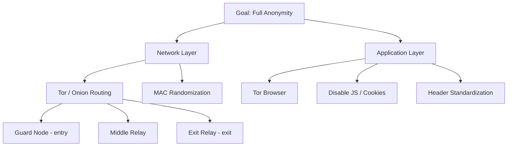

---

tags:

- security
- anonymity
- privacy
- tor
- onion-routing
- network-security

---

# Anonymity and Privacy

## Tổng quan

**Anonymity** (ẩn danh) và **Privacy** (riêng tư) là hai thuộc tính bảo mật quan trọng nhưng khác nhau về bản chất. Trong thế giới số hóa ngày nay, dữ liệu người dùng đã trở thành hàng hóa — "If you're not paying for it, you become the product." Mọi lớp của network stack đều có thể rò rỉ thông tin nhận dạng, và việc đạt được anonymity thực sự trên Internet là một bài toán cực kỳ khó. Bài giảng này phân tích từng vector rò rỉ và các cơ chế phòng thủ, đặc biệt tập trung vào Tor — mạng ẩn danh phổ biến nhất hiện nay.

---

## Nội dung chi tiết

### 1. Định nghĩa: Anonymity vs Privacy

|Khái niệm|Định nghĩa|Câu hỏi trả lời|
|---|---|---|
|**Anonymity**|Người dùng có thể sử dụng tài nguyên/dịch vụ mà không tiết lộ danh tính. Các chủ thể khác không thể xác định danh tính của người dùng.|_"Bạn là ai?"_ — không thể biết|
|**Privacy**|Quyền của cá nhân/tổ chức tự quyết định **khi nào**, **như thế nào**, và **ở mức độ nào** thông tin về họ được chia sẻ với người khác.|_"Bạn đang làm gì?"_ — không thể biết|

> [!note] Phân biệt rõ hơn
> 
> - **Anonymity** = ẩn **danh tính** (ai đang làm)
> - **Privacy** = ẩn **thông tin/hành động** (đang làm gì)
> - Hai khái niệm bổ sung cho nhau nhưng độc lập: bạn có thể ẩn danh nhưng không riêng tư (dùng Tor để post công khai), hoặc riêng tư nhưng không ẩn danh (dùng real name nhưng mã hóa nội dung).

**Hai thuộc tính liên quan:**

- **Unlinkability**: không thể liên kết các hành động khác nhau của cùng một người dùng
- **Unobservability**: không thể phát hiện ra rằng communication đang xảy ra

**Adversary model** phổ biến:

- MITM (eavesdropping hoặc active)
- Contacted endpoint (ví dụ: website operator biết bạn đang truy cập)

---

### 2. Các điểm rò rỉ thông tin theo Network Stack

Mọi lớp của mô hình OSI đều có thể tiết lộ danh tính hoặc hành vi người dùng:

#### 2.1 Physical Layer

- Yêu cầu truy cập vật lý vào phần cứng/medium của mạng
- **Network tap**: thiết bị nghe lén traffic vật lý
- Adversary đủ mạnh có thể xác định vị trí vật lý từ tín hiệu RF

#### 2.2 Data Link Layer — MAC Address

- **MAC address** (Media Access Control) phải unique để routing trong LAN
- Manufacturer encode vào 3 byte đầu của MAC → **OUI (Organizationally Unique Identifier)**
- MAC address tiết lộ: nhà sản xuất, đôi khi cả model thiết bị, nhà máy sản xuất, series
- **Phạm vi quan sát**: MAC chỉ thấy được trong cùng broadcast domain (không qua router)
- **Ứng dụng tracking**: WiFi probe requests, BLE advertising — thiết bị liên tục broadcast MAC để tìm mạng quen thuộc → có thể track người di chuyển trong trung tâm thương mại

> [!tip] Phòng chống MAC tracking **MAC address randomization**: iOS, Android, Linux hiện đại tự động randomize MAC khi scan WiFi (không kết nối). Khi đã kết nối, một số thiết bị vẫn dùng MAC thật → vẫn trackable trong một network.

#### 2.3 Network Layer — IP Address

- ==Đây là mục tiêu chính để lộ danh tính trên Internet==
- **AS (Autonomous System)**: các dải địa chỉ IP được phân bổ cho tổ chức cụ thể → ai sở hữu IP nào là thông tin công khai (WHOIS, RIPE, ARIN...)
- **IP thường static**: nhiều ISP gán IP cố định hoặc ít thay đổi → bind với người dùng cụ thể
- **DNS**: mapping giữa IP và domain name → thêm một vector nhận dạng
- **NAT (Network Address Translation)**: nhiều người dùng chia sẻ một public IP → giảm chính xác _một chút_, nhưng anonymity set vẫn nhỏ
- **Traffic analysis**: thống kê lưu lượng (timing, volume, pattern) có thể nhận dạng người dùng ngay cả khi nội dung được mã hóa
- **Active fingerprinting**: các OS khác nhau set TTL ban đầu khác nhau (Linux = 64, Windows = 128, Cisco = 255) → có thể đoán OS từ packet

#### 2.4 Transport Layer — TCP

- **Port numbers**: tiết lộ ứng dụng đang chạy (80=HTTP, 443=HTTPS, 22=SSH...)
- **Passive fingerprinting**: TCP sequence number, congestion window size, TCP options (SACK, timestamps, window scaling) → nhận dạng TCP stack implementation → nhận dạng OS/phần mềm
- **Active fingerprinting**: gửi TCP segments với flags bất thường, quan sát phản ứng

#### 2.5 Application Layer

- **Session identifiers**: session tokens, usernames, cookies
- **Location & language**: HTTP `Accept-Language`, timezone, IP geolocation
- **Software version**: `User-Agent` header tiết lộ browser và version chính xác
- **Encoding preferences**: `Accept-Encoding`, `Accept` headers
- **Data content**: nội dung request/response

> [!question] Thảo luận: Incognito mode có ẩn danh không? Kể cả khi dùng incognito, `sutd.edu.sg` vẫn biết được: IP address của bạn, browser và OS (từ User-Agent), kích thước màn hình, timezone, ngôn ngữ, các font đã cài, plugins, và hàng chục thuộc tính khác → **browser fingerprinting**. Incognito chỉ ngăn browser _lưu lại_ lịch sử trên máy bạn — không ẩn danh với server.

---

### 3. Cơ chế cải thiện Privacy và Anonymity

#### 3.1 Encryption — Điều kiện cần nhưng chưa đủ

Encryption (mã hóa) ẩn nội dung của các lớp phía trên:

- **IPSec**: bảo vệ transport layer (ẩn ports, TCP flags)
- **TLS**: bảo vệ application layer (ẩn HTTP content)

**Nhưng ngay cả với encryption, passive adversary vẫn học được:**

- **Timing**: khi nào bạn giao tiếp
- **Packet length**: kích thước dữ liệu → có thể suy luận nội dung

> [!example] Tấn công qua timing/length Nếu bạn browse `https://wikipedia.org`, trang tiếng Anh và tiếng Việt có kích thước khác nhau. Adversary quan sát encrypted traffic có thể đoán bạn đang đọc trang nào dựa trên pattern kích thước gói tin — đây gọi là **website fingerprinting attack**.

**Encryption không ẩn metadata**: ai giao tiếp với ai, tần suất, thời điểm — vẫn visible.

---

### 4. Network-layer Anonymity

Để thực sự ẩn danh, **phải** bảo vệ từ Network layer trở lên. Bảo vệ Application layer mà không bảo vệ Network layer là vô nghĩa vì IP address đã đủ để nhận dạng bạn với độ chính xác cao.

**Requirements cho một anonymous communication system:**

- **Low latency** (quan trọng nhất với người dùng thông thường)
- Bandwidth đủ dùng
- Security đủ mạnh

**Adversary model** từ yếu đến mạnh:

- ISP của bạn
- State-level adversary (chính phủ quan sát một phần Internet)
- Global adversary (NSA-level, quan sát toàn bộ Internet)
- Bob (destination) — biết ai đang kết nối đến mình

---

### 5. Proxy Servers

**Ý tưởng cơ bản**: Alice không kết nối trực tiếp đến Bob. Thay vào đó, Alice gửi request (qua kênh bảo mật) đến một **proxy server**, proxy forward request đến Bob.

**Các dạng triển khai:**

- SSL/TLS tunnels (stunnel)
- SOCKS proxies
- VPN (Virtual Private Network)

**Ưu điểm:**

- Latency không quá tệ
- Dễ deploy

**Nhược điểm:**

- Proxy server là **single point of trust** — nếu bị compromise hoặc bị ép bởi chính phủ, toàn bộ anonymity mất
- Thường là dịch vụ trả phí
- Bob biết proxy đang kết nối → proxy biết cả Alice và Bob → một entity biết cả hai phía

> [!warning] VPN không phải anonymity VPN dịch chuyển trust từ ISP sang VPN provider. Nếu VPN provider bị subpoena (lệnh tòa án), log của bạn có thể bị tiết lộ. "No-log" policy là cam kết, không phải đảm bảo kỹ thuật.

---

### 6. Onion Routing — Nguyên lý cốt lõi của Tor

**Vấn đề với proxy đơn**: Proxy biết cả người gửi (Alice) và người nhận (Bob).

**Giải pháp**: Dùng **nhiều proxy** và mỗi proxy chỉ biết **bước liền kề** trong chuỗi.

**Design goal**: ==Không một node nào có thể biết đồng thời cả Alice và Bob.==

**Tên gọi "Onion"**: Mỗi lớp mã hóa như một lớp của củ hành — mỗi relay chỉ bóc được một lớp để biết bước tiếp theo.

**Cơ chế:**

- Alice mã hóa message **nhiều lớp** với public key của từng relay theo thứ tự ngược
- Relay 1 giải mã lớp ngoài cùng → thấy "forward đến Relay 2" → không biết gì hơn
- Relay 2 giải mã lớp tiếp theo → thấy "forward đến Bob" → không biết Alice là ai
- Bob nhận plaintext → không biết qua bao nhiêu hops, Alice là ai

---

### 7. Tor — The Onion Router

**Tor** là mạng ẩn danh low-latency, open-source, phổ biến nhất hiện nay. Nó là **overlay network** — chạy trên hạ tầng Internet thông thường nhưng định tuyến traffic qua các **mix nodes** (onion routers).

#### 7.1 Quy mô mạng Tor

Theo số liệu từ metrics.torproject.org (2021):

- **~2–4 triệu** người dùng kết nối trực tiếp mỗi ngày (peak khoảng 4 triệu)
- **~6,737 relays** (khoảng 4,859 visible), tổng bandwidth ~600 Gbit/s advertised
- Người dùng phân bố toàn cầu — Châu Âu (Đức, Pháp, Nga, Ý) và Mỹ chiếm tỷ lệ cao nhất so với dân số Internet

#### 7.2 Các loại node trong Tor Network

|Node|Vai trò|
|---|---|
|**Guard/Entry node**|Node đầu tiên trong circuit — biết IP của Alice|
|**Middle relay**|Node giữa — không biết Alice hay Bob, chỉ biết node kề|
|**Exit relay**|Node cuối — kết nối ra Internet tới Bob; biết destination nhưng không biết Alice|
|**Bridge**|Entry node không được publish công khai → dùng để bypass censorship (IP không bị blacklist)|

> [!warning] Ai chịu rủi ro pháp lý? **Exit relay operator** là người có traffic "xuất hiện" từ địa chỉ của họ đến destination. Nếu ai đó dùng Tor để làm việc phi pháp, exit relay operator có thể bị điều tra — dù họ không biết nội dung. Đây là lý do ít người vận hành exit relay hơn middle relay.

#### 7.3 Tor Circuit — Cơ chế thiết lập kết nối

Một **circuit** gồm: 1 Guard node + 1 Middle relay + 1 Exit relay = 3 hops.

Circuit được **client chọn** (không phải server quyết định), sử dụng thuật toán randomized selection có tính đến bandwidth và uptime của relay.

**Quá trình thiết lập circuit** (từ Fig 1 của paper "Tor: The Second-Generation Onion Router"):

```
Alice                    OR 1 (TLS)              OR 2              Website
  |--- Create c1, E(g^x1) ----------------->|                        |
  |<-- Created c1, g^y1, H(K1) ------------|                        |
  |--- Relay c1{Extend, OR2, E(g^x2)} ---->|                        |
  |                    |--- Create c2, E(g^x2) -------->|           |
  |                    |<-- Created c2, g^y2, H(K2) ----|           |
  |<-- Relay c1{Extended, g^y2, H(K2)} ----|                        |
  |                                                                   |
  |--- Relay c1{{Begin <website>:80}} ---->|                        |
  |                    |--- Relay c2{Begin <website>:80} ->|        |
  |                    |                   |--- TCP handshake ------>|
  |<-- Relay c1{{Connected}} --------------|                        |
  |--- Relay c1{{Data, "HTTP GET..."}} --->|                        |
  |                    |--- Relay c2{Data, "HTTP GET..."} ->|       |
  |                    |                               "HTTP GET..."|
```

**Ký hiệu:**

- `E(x)` = RSA encryption
- `{X}` = AES encryption (symmetric, sau khi key exchange)
- `cN` = circuit ID

**Key insight**: Alice dùng **Diffie-Hellman key exchange** riêng với **từng** relay. OR 1 chỉ thấy ciphertext của phần dành cho OR 2 — không thể decrypt. Kết quả: mỗi relay có session key riêng, Alice wrap nhiều lớp AES encryption.

> [!note] Tại sao mỗi website cần circuit mới? Nếu dùng cùng một circuit cho nhiều website, các website có thể **collude** (thông đồng) để link các session lại với nhau. Bằng cách tạo circuit mới cho mỗi site, Alice ngăn việc correlation.

---

### 8. Tor Hidden Services (Onion Services)

Hidden Services giải quyết bài toán ngược: ẩn **server** (Bob), không chỉ client (Alice).

**Đặc điểm:**

- Chỉ accessible trong Tor network (TLD: `.onion`)
- Người khác biết **danh tính** của service (public key) nhưng không biết **vị trí** (IP address)
- Tên `.onion` 16 ký tự (v2) hoặc 56 ký tự (v3) được derive từ public key của service

**Ví dụ thực tế:** DuckDuckGo có hidden service tại `3g2upl4pq6kufc4m.onion` — người dùng Tor có thể search mà không cần exit relay (traffic không bao giờ rời Tor network).

#### Giao thức thiết lập Hidden Service (6 bước)

**Các thành phần:**

- **Alice**: client muốn truy cập dịch vụ
- **Bob**: server hosting hidden service (XYZ.onion)
- **DB**: Distributed database (Hidden Service Directory) — lưu service descriptors
- **IP1-3**: Introduction Points — relay trong Tor mà Bob kết nối sẵn
- **RP**: Rendezvous Point — relay trung gian để Alice và Bob gặp nhau
- **cookie**: One-time secret để xác nhận phiên

---

**Bước 1 — Bob chọn Introduction Points:**

```
Bob ──(circuit)──> IP1
Bob ──(circuit)──> IP2
Bob ──(circuit)──> IP3
```

Bob xây dựng circuit đến một số Introduction Points và giữ các circuit này mở.

---

**Bước 2 — Bob publish Service Descriptor lên DB:**

Bob gửi lên DB một **onion service descriptor** chứa:

- Public key (PK) của service
- Danh sách Introduction Points (IP1, IP2, IP3)
- Toàn bộ được **ký bằng private key** của Bob

Descriptor này là cơ sở để Alice tìm thấy Bob.

---

**Bước 3 — Alice tìm kiếm service + chọn Rendezvous Point:**

Alice nghe thấy về `XYZ.onion`, query DB để lấy descriptor (IP list + PK). Alice đồng thời chọn một relay trong Tor làm **Rendezvous Point (RP)** và tạo circuit đến RP.

---

**Bước 4 — Alice gửi "introduction message" đến Bob qua IP:**

Alice tạo một message được mã hóa bằng PK của Bob, chứa:

- Địa chỉ của RP
- One-time secret (cookie)

Message này được gửi qua circuit của Alice đến một Introduction Point (ví dụ IP2), IP2 forward đến Bob (qua circuit của Bob).

---

**Bước 5 — Bob kết nối đến Rendezvous Point:**

Bob nhận được message, giải mã bằng private key → biết RP và cookie. Bob xây dựng circuit từ phía mình đến RP, gửi cookie để xác nhận.

---

**Bước 6 — Kết nối hoàn tất:**

RP xác nhận cookie khớp → **nối hai circuit lại** (circuit của Alice và circuit của Bob). Alice và Bob giờ có kênh giao tiếp end-to-end qua 6 hops tổng cộng (3 của Alice + 3 của Bob).

```
Alice ──[3 hops]──> RP <──[3 hops]── Bob
```

> [!note] Hidden Service circuit trong Tor Browser Slide 35 minh họa một hidden service circuit thực tế khi truy cập `rougmnvswfsmd4dq.onion`: `This browser → Sweden (Guard) → Germany → Germany → Relay → Relay → Relay → .onion` 6 hops thay vì 3 hops thông thường — vì cả Alice và Bob đều dùng 3-hop circuit.

---

### 9. Vấn đề và Hạn chế của Tor

#### 9.1 Performance

- **Latency cao**: mỗi packet phải đi qua 3+ hops → không phù hợp cho VoIP, gaming, streaming real-time
- **Bandwidth bị giới hạn**: phụ thuộc vào capacity của relay được chọn
- **Overhead mã hóa/giải mã**: nhiều lớp AES encryption

#### 9.2 Censorship và Discovery

- **IP blacklisting**: các chính phủ/tổ chức có thể blacklist public IP của Tor relays → **Bridges** giải quyết vấn đề này (IP không public)
- **Tor abuse**: exit relay traffic có thể bị block bởi các website (vì bị dùng để spam/attack)
- **DoS**: relays có thể bị tấn công từ chối dịch vụ

#### 9.3 Áp lực chính trị/pháp lý

- Node operators **có thể bị ép** bởi chính phủ của quốc gia họ vận hành
- ==**Giải pháp**: dùng relay từ nhiều quốc gia khác nhau — giảm xác suất tất cả bị compromise bởi một thực thể==
- **Trade-off**: relay ở các quốc gia khác nhau → latency cao hơn

#### 9.4 Tấn công nâng cao

**Timing Attack (Traffic Correlation):** Nếu adversary có thể quan sát **cả** traffic vào và ra của Tor network cho một circuit:

- Quan sát Alice gửi packet → vài ms sau Bob nhận packet tương tự
- Timing correlation → deanonymize Alice

Giải pháp lý thuyết: thêm **random delay** (padding), nhưng làm tăng latency đáng kể → trade-off với usability.

**Website Fingerprinting:** Ngay cả khi dùng Tor và HTTPS, pattern kích thước/timing của packets cho một website là khá unique. Machine learning có thể nhận dạng bạn đang truy cập trang nào với độ chính xác đáng lo ngại.

**Global Adversary:** Nếu adversary có thể quan sát **toàn bộ** input và output của Tor network → Tor không bảo vệ được. Đây là adversary model quá mạnh, nhưng trong thực tế các cơ quan tình báo lớn có khả năng này ở một mức độ nhất định.

> [!warning] Tor không bảo vệ chống global adversary Đây là limitation được thừa nhận chính thức của Tor. Nếu bạn cần bảo vệ chống adversary cực mạnh (state-level), cần dùng thêm các biện pháp khác (high-latency mixnets như Mixmaster, I2P, v.v.)

---

### 10. Private Web Browsing

**Tại sao Tor có browser riêng (Tor Browser)?**

Ngay cả khi dùng Tor để ẩn IP, browser thông thường rò rỉ nhiều thông tin khác qua:

- **JavaScript**: I/O timing, mouse movements, window layout, screen size → behavioral fingerprinting
- **Cookies và DOM storage**: tracking across sessions
- **HTTP Headers**: `User-Agent`, `Referer`, `Accept-Language`
- **Credentials và Client certificates**: auto-submitted
- **Browser Extensions**: mỗi extension tạo unique fingerprint
- **WebRTC**: có thể leak local/real IP ngay cả khi dùng VPN/Tor

**Tor Browser** phòng thủ bằng:

- Dựa trên Firefox ESR với nhiều patches
- JavaScript restrictions (hoặc disable hoàn toàn)
- Chặn cookies và DOM storage
- Header randomization/standardization (tất cả user trông giống nhau)
- Tab isolation (mỗi tab dùng circuit riêng)
- Không dùng client certificates
- Block WebRTC leaks

> [!tip] EFF Cover Your Tracks Electronic Frontier Foundation có tool tại `coveryourtracks.eff.org` — test xem browser của bạn có unique fingerprint không và trackers có thể track bạn như thế nào. Slide 39 trong bài giảng dẫn đến tool này.

---

## Mô hình tóm tắt: Defense-in-Depth cho Anonymity



---

## So sánh các giải pháp Anonymity

|Giải pháp|Anonymity|Latency|Trust Model|Chống global adversary|
|---|---|---|---|---|
|**VPN**|Thấp|Tốt|Tin vào VPN provider|❌|
|**Single Proxy**|Thấp-Trung|Tốt|Tin vào proxy operator|❌|
|**Tor (3 hops)**|Cao|Kém|Không cần tin ai — phân tán|❌|
|**Tor Hidden Service**|Rất cao|Kém nhất|Phân tán hoàn toàn|❌|
|**High-latency Mixnet**|Rất cao|Rất kém|Phân tán|✅|

---

## Tóm tắt & Takeaways

- **Anonymity ≠ Privacy**: Anonymity ẩn danh tính (ai), Privacy ẩn thông tin/hành động (làm gì). Hai tính chất bổ sung cho nhau.
- **Mọi lớp của network stack đều rò rỉ thông tin**: từ MAC address (Data Link) đến User-Agent (Application). Defense phải toàn diện theo chiều sâu.
- **Encryption là cần nhưng chưa đủ**: metadata (timing, length, ai giao tiếp với ai) vẫn visible ngay cả khi nội dung được mã hóa.
- **Tor = onion routing + nhiều proxy**: mỗi relay chỉ biết bước liền kề; không relay nào biết cả Alice và Bob.
- **Guard → Middle → Exit**: ba loại relay với vai trò khác nhau và mức độ rủi ro pháp lý khác nhau (exit relay chịu rủi ro cao nhất).
- **Tor Hidden Services**: 6 bước phức tạp dùng Introduction Points và Rendezvous Point để ẩn cả server — không chỉ client.
- **Tor không phải silver bullet**: timing attacks, website fingerprinting, và global adversary vẫn là vector tấn công nghiêm trọng.
- **Tor Browser quan trọng không kém Tor network**: nếu browser leak fingerprint, anonymity ở network layer trở nên vô nghĩa.
- **"If you're not paying for it, you become the product"** — nhắc nhở về mô hình kinh doanh của Internet và tầm quan trọng của anonymity/privacy.

---

## Liên kết kiến thức

- [[Network Security]]
- [[TLS và Encryption]]
- [[User Authentication]]
- [[SS-Week4]]
- [[Traffic Analysis]]
- [[Browser Fingerprinting]]
- [[VPN và Proxy]]
- [[Side Channel Attacks]]
- [[Cryptography — Public Key Infrastructure]]